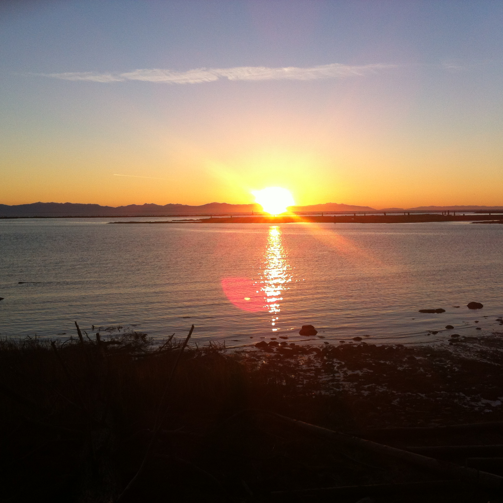

<!-- README.md is generated from README.Rmd. Please edit that file -->

  

This package creates .CSV files of sunset and sunrise appointments--with a user-specified location that can be imported into Google Calender. Function sunset\_calc is taken from Hilary Parker's Personal R package and has been modified.[Hilary Parker Github](https://github.com/hilaryparker/hilary/tree/master/R)

To install this package you could follow the following:  

1. Install `devtools()` in Rstudio ( if you already don't have it) :  

`install_packages("devtools")`

or load the package :  

`library(devtools)`

2. Install `sunsetrise` package with `devtools`:

`devtools::install_github("gjahesh/sunsetrise")`

3. Load `sunsetrise` package using `devtools`

`devtools::library(foofactors)`

The imported packages as mentioned in the DESCRIPTION file are:

+ `StreamMetabolism` [CRAN](https://cran.r-project.org/web/packages/StreamMetabolism/index.html)

+ `dplyr`[Hadley-Github](https://github.com/hadley/dplyr)

